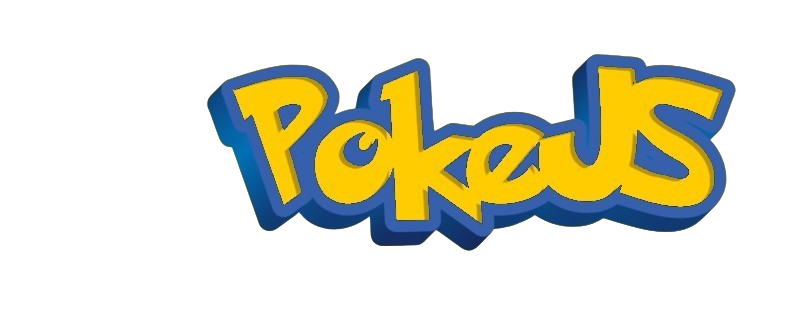

# English:
## PokeJS is a game made in JavaScript, a recreation similar to the well-known Pokémon Fire-Red, developed by beginner developers.

##### The project aims to develop a game similar to Pokémon Fire-Red, where the player can walk around the map with diverse scenarios, interactive NPCs, missions and an interesting story to entertain the player.

# Portuguese:

## PokeJS é um jogo feito com JavaScript, uma recriação similar Pokémon Fire-Red que conhecemos, feito por desenvolvedores iniciantes.

##### O projeto visa desenvolver um jogo semelhante ao Pokémon Fire-Red, onde o jogador pode anter pelo mapa com diversos cenários, NPCs interativos, missões e uma história interessante para entreter o jogador.